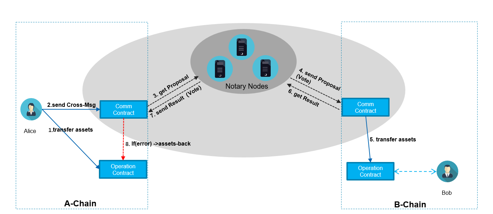

English | [中文](ReadMe.md) 

# Framework

We have designed a simple and secure protocol for cross-chain asset transfer and implemented cross-chain asset transfer based on BUChain.
The framework is as follows:

# Development Manual

This development manual contains introduction to the test network, experiencing cross-chain, and development instructions
[Development Manual](https://github.com/zjg555543/bubichain-v3/blob/feature/crosschain/docs/cross_chain/Dev_Manual_CN.md "Development Manual").

# Contents of Code 

[Code of Notary](https://github.com/zjg555543/bubichain-v3/tree/feature/crosschain/src/notary "Code of Notary")

[Code of Communication Contract](https://github.com/zjg555543/bubichain-v3/blob/feature/crosschain/docs/cross_chain/cross_comm.js "Code of Communication Contract")

[Code of Asset Contract](https://github.com/zjg555543/bubichain-v3/blob/feature/crosschain/docs/cross_chain/cross_asset.js "Code of Asset Contract")